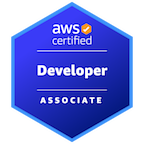

### Bem Vindo !!!

  Meu nome é Ademilson, sou desenvolvedor a mais de 7 anos, trabalho principalmente com backend e com algumas tecnologias de front. 

    Diria que sou generalista já trabalhei com muitas linguagens,
    minha principal experiecia é com PHP, mas já atuei em projetos Java, Javascript e Python.

    Tenho vasta experiencia com sistemas em nuvem, principalmente AWS que tenho certificação.
    Já desenvolvi e projetei sistemas e micro serviços que rodam em containers, serverless, usando eventos, api, de tudo um pouco.

- 👨‍💻 Atualmente trabalho como desenvolvedor da Rentcars, principalmente com backend
- 📚 Ultimamente tenho lido muito sobre arquitetura e boas práticas de desenvolvimento 
- 🏫 Cursando pós graduação em arquitetura de software
- 🏃‍♂️ Na corrida para aprender inglês !!!

### Certificações 

### Visite meus projetos
- [API Nodejs com NestJs](https://github.com/ademilsoncarvalho/cats-api)
- [API Java com Quarkus](https://github.com/ademilsoncarvalho/quarkus-booking)
- [API Serverless DynamoDB](https://github.com/ademilsoncarvalho/api-node-serverless)
- [Modelo de API Python](https://github.com/ademilsoncarvalho/python_minimal_api)

### Algumas Técnologias
<code></code>
<code></code>
<code></code>
<code></code>
<code></code>
<code></code>
<code></code>
 
<code></code>
<code></code>
<code></code>
<code></code>
<code></code>
<code></code>
 
<code></code>
 
<code></code>
<code></code>

## Algumas Informações

     
    

### Como me encontrar

